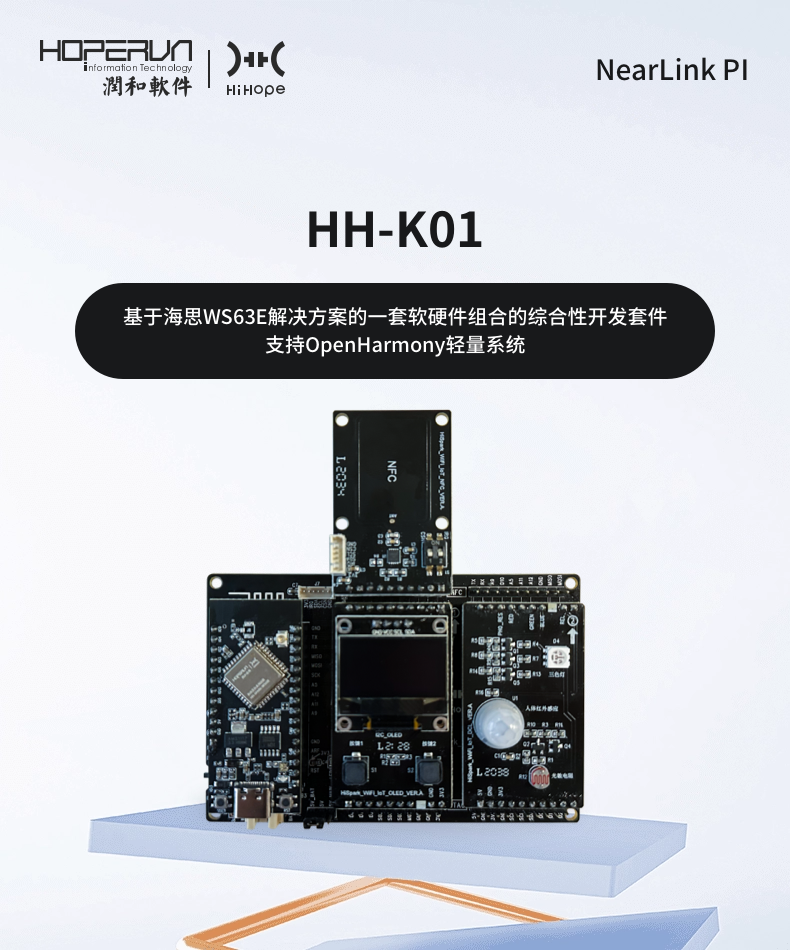

# HopeRun IoT Development Kit--Mutex


An integrated software and hardware development kit based on WS63E solution, providing a comprehensive suite for embedded system development.



## 1. Mutex API

| API             | **Description**                                              |
| --------------- | ------------------------------------------------------------ |
| osMutexNew      | Create and initialize a mutex                                |
| osMutexGetName  | Get the name of the specified mutex                          |
| osMutexAcquire  | Acquire the specified mutex; if the mutex is already locked, return a timeout |
| osMutexRelease  | Release the specified mutex                                  |
| osMutexGetOwner | Get the owner thread of the specified mutex                  |
| osMutexDelete   | Delete the specified mutex                                   |

## 2. Code

The global variable `g_test_value`, if accessed simultaneously by multiple threads, will be incremented by 1, and then its parity (odd or even) will be checked and logged. Without a mutex to protect it, the threads can be interrupted, leading to errors. Therefore, a mutex is needed to protect the shared area in a multi-threaded environment.

```c
void number_thread(void *arg) {
    osMutexId_t *mid = (osMutexId_t *)arg;
    while(1) {
        if (osMutexAcquire(*mid, 100) == osOK) {
            g_test_value++;
            if (g_test_value % 2 == 0) {
                printf("[Mutex Test] %s gets an even value %d.\r\n", osThreadGetName(osThreadGetId()), g_test_value);
            } else {
                printf("[Mutex Test] %s gets an odd value %d.\r\n",  osThreadGetName(osThreadGetId()), g_test_value);
            }
            osMutexRelease(*mid);
            osDelay(5);
        }
    }
}
```

Create three threads to access the global variable `g_test_value`, and create a mutex for all the threads to use.

```c
void rtosv2_mutex_main(void *arg) {
    (void)arg;
    osMutexAttr_t attr = {0};

    osMutexId_t mid = osMutexNew(&attr);
    if (mid == NULL) {
        printf("[Mutex Test] osMutexNew, create mutex failed.\r\n");
    } else {
        printf("[Mutex Test] osMutexNew, create mutex success.\r\n");
    }

    osThreadId_t tid1 = newThread("Thread_1", number_thread, &mid);
    osThreadId_t tid2 = newThread("Thread_2", number_thread, &mid);
    osThreadId_t tid3 = newThread("Thread_3", number_thread, &mid);

    osDelay(13);
    osThreadId_t tid = osMutexGetOwner(mid);
    printf("[Mutex Test] osMutexGetOwner, thread id: %p, thread name: %s.\r\n", tid, osThreadGetName(tid));
    osDelay(17);

    osThreadTerminate(tid1);
    osThreadTerminate(tid2);
    osThreadTerminate(tid3);
    osMutexDelete(mid);
}
```


## 3. **Compile**

1. Copy the `00_thread` directory to the `applications\sample\wifi-iot\app` directory within the Oniro source code.
2. Modify the `BUILD.gn` in the `applications\sample\wifi-iot\app` directory of the Oniro source code by replacing the `features` variable with:

```
    features = [
        ...
        "03_mutex:mutex_demo",
        ...
    ]
```
3. In the file `config.py` located at `device\soc\hisilicon\ws63v100\sdk\build\config\target_config\ws63`, locate the section labeled `'ws63-liteos-app'`. Within this section, add the following code to the `'ram_component'` field:
```
"mutex_demo"
```

4. In the file `ohos.cmake` located at `device\soc\hisilicon\ws63v100\sdk\libs_url\ws63\cmake`, locate the section labeled `"ws63-liteos-app"`. Within this section, find the `set(COMPONENT_LIST` statement and append the following code to its argument list:
```
"mutex_demo"
```
5. Execute the following command in the root directory of the Oniro SDK: `rm -rf out && hb set -p nearlink_dk_3863 && hb build -f`

## 4. Result

Set the serial port tool's baud rate to 115200, reset the development board, and observe the printed output.

```
[Mutex Test]Thread_1 gets an even value 4.
[Mutex Test]Thread_2 gets an odd value 5.
[Mutex Test]Thread_3 gets an even value 6.

[17:45:54.066]收←◆[Mutex Test]Thread_1 gets an odd value 7.
[Mutex Test]Thread_2 gets an even value 8.
[Mutex Test]Thread_3 gets an odd value 9.
[Mutex Test]osMutexGetOwner, thread id: (nil), thread name: (null).

[17:45:54.115]收←◆[Mutex Test]Thread_1 gets an even value 10.
[Mutex Test]Thread_2 gets an odd value 11.
[Mutex Test]Thread_3 gets an even value 12.

[17:45:54.165]收←◆[Mutex Test]Thread_1 gets an odd value 13.
[Mutex Test]Thread_2 gets an even value 14.
[Mutex Test]Thread_3 gets an odd value 15.

[17:45:54.215]收←◆[Mutex Test]Thread_1 gets an even value 16.
[Mutex Test]Thread_2 gets an odd value 17.
[Mutex Test]Thread_3 gets an even value 18.

```

### 【Dev-kits】

##### 1. Online marketplaces  https://item.taobao.com/item.htm?abbucket=16&id=816685710481&ns=1&priceTId=214783b117346662457694855ed644&skuId=5533042544092&spm=a21n57.sem.item.49.46a639031zWytE&utparam=%7B%22aplus_abtest%22%3A%22b28048df8f009463834be6bdac2a3713%22%7D&xxc=taobaoSearch

##### 2. **Technical Documentation**

- **Gitee CodeCloud** (User Manuals, Specifications, Oniro Development Cases) **https://gitee.com/hihopeorg_group/near-link**
- **fbb_ws63 Repository** (SDK Packages, Technical Documentation Downloads)**https://gitee.com/HiSpark/fbb_ws63**

##### 3. **Interaction and Support**

- **Hisilicon Community - NearLink Zone Forum** **https://developer.hisilicon.com/forum/0133146886267870001**

