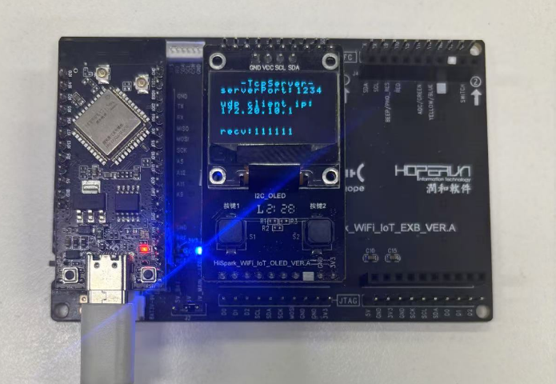
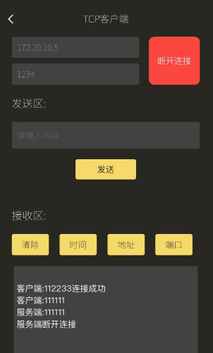

# HopeRun IoT Development Kit--WS63 acts as a TCP server to communicate with the remote client.


An integrated software and hardware development kit based on WS63E solution, providing a comprehensive suite for embedded system development.


## 1. **Compile**

1. Copy the `12_oled、14_easy_wifi、16_tcpserver` directory to the `applications\sample\wifi-iot\app` directory within the Oniro source code
2. Modify the `BUILD.gn` in the `applications\sample\wifi-iot\app` directory of the Oniro source code by replacing the `features` variable with:
```
    features = [
       ...
       "12_oled/src:oled_ssd1306",
       "14_easy_wifi/src:easy_wifi",
       "16_tcpserver:tcpserver",
       ...
    ]
```
3. In the file `config.py` located at `device\soc\hisilicon\ws63v100\sdk\build\config\target_config\ws63`, locate the section labeled `'ws63-liteos-app'`. Within this section, add the following code to the `'ram_component'` field:
```
"oled_ssd1306" ,"easy_wifi" ,"tcpserver"
```

4. In the file `ohos.cmake` located at `device\soc\hisilicon\ws63v100\sdk\libs_url\ws63\cmake`, locate the section labeled `"ws63-liteos-app"`. Within this section, find the `set(COMPONENT_LIST` statement and append the following code to its argument list:
```
"oled_ssd1306"  "easy_wifi"  "tcpserver"
```
5. Execute the following command in the root directory of the Oniro SDK: `rm -rf out && hb set -p nearlink_dk_3863 && hb build -f`


## 2. Experiment Steps and Results

1. Flash the program to the development board.

2. Reset the development board. The board will first attempt to connect to the Wi-Fi network. The Wi-Fi name (SSID) should match the configuration in the `connect_wifi_test.c` file. Once the Wi-Fi connection is successful, the OLED screen will display the port number of the WS63 server, which is 1234 by default.
3. Connect your phone or computer to the Wi-Fi hotspot. The Wi-Fi network should be the same as the one the WS63 development board is connected to. Start a TCP client and connect it to the WS63 server. Configure the IP address to the IP address of the WS63 server (you can find the IP address in the serial port output of the WS63, as shown in the red box in the image below). Set the port to the port number of the WS63 server, which is 1234 by default.


4. Once the TCP client successfully connects, the OLED screen will display the IP address of the client.

5. After the TCP client sends a message to the development board, the board's OLED screen and serial port will display the message received from the TCP client.

  

  

### 【Dev-kits】

##### 1. Online marketplaces  https://item.taobao.com/item.htm?abbucket=16&id=816685710481&ns=1&priceTId=214783b117346662457694855ed644&skuId=5533042544092&spm=a21n57.sem.item.49.46a639031zWytE&utparam=%7B%22aplus_abtest%22%3A%22b28048df8f009463834be6bdac2a3713%22%7D&xxc=taobaoSearch

##### 2. **Technical Documentation**

- **Gitee CodeCloud** (User Manuals, Specifications, Oniro Development Cases) **https://gitee.com/hihopeorg_group/near-link**
- **fbb_ws63 Repository** (SDK Packages, Technical Documentation Downloads)**https://gitee.com/HiSpark/fbb_ws63**

##### 3. **Interaction and Support**

- **Hisilicon Community - NearLink Zone Forum** **https://developer.hisilicon.com/forum/0133146886267870001

