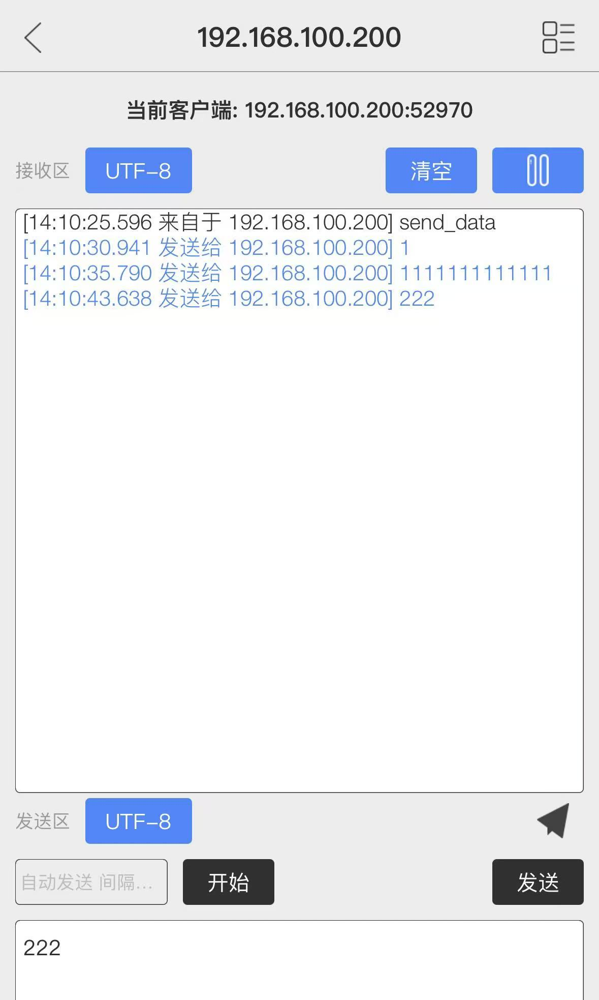
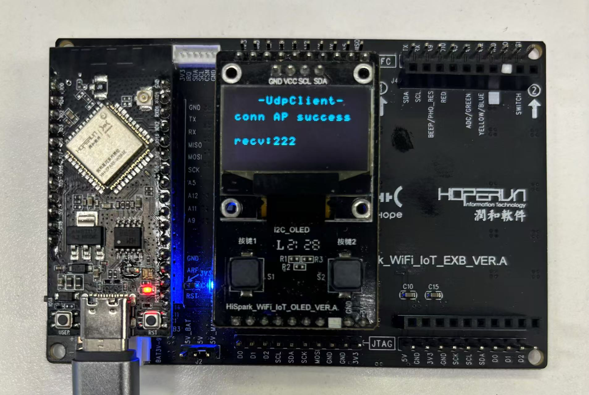

# HopeRun IoT Development Kit--WS63 acts as a udp server to communicate with the remote server.


An integrated software and hardware development kit based on WS63E solution, providing a comprehensive suite for embedded system development.


## 1. **Compile**

1. Copy the `12_oled、14_easy_wifi、17_udpclient` directory to the `applications\sample\wifi-iot\app` directory within the Oniro source code
2. Modify the `BUILD.gn` in the `applications\sample\wifi-iot\app` directory of the Oniro source code by replacing the `features` variable with:

```
    features = [
      ...
       "12_oled/src:oled_ssd1306",
       "14_easy_wifi/src:easy_wifi",
       "17_udpclient:udpclient",
      ...
    ]
```
3. In the file `config.py` located at `device\soc\hisilicon\ws63v100\sdk\build\config\target_config\ws63`, locate the section labeled `'ws63-liteos-app'`. Within this section, add the following code to the `'ram_component'` field:
```
"oled_ssd1306" ,"easy_wifi" ,"udpclient"
```

4. In the file `ohos.cmake` located at `device\soc\hisilicon\ws63v100\sdk\libs_url\ws63\cmake`, locate the section labeled `"ws63-liteos-app"`. Within this section, find the `set(COMPONENT_LIST` statement and append the following code to its argument list:
```
"oled_ssd1306"  "easy_wifi"  "udpclient"
```
5. Execute the following command in the root directory of the Oniro SDK: `rm -rf out && hb set -p nearlink_dk_3863 && hb build -f`


## 2. Steps and Results

1. Flash the program to the development board.

2. Connect your phone or computer to the Wi-Fi hotspot. The Wi-Fi name (SSID) should match the configuration in the `connect_wifi_test.c` file. Start a UDP server with the port number and IP address configured in the `connect_wifi_test.c` file.
3. Reset the development board. The board will first attempt to connect to the Wi-Fi network, which should be the same as the one your phone or computer is connected to. After connecting to the Wi-Fi, the board will send a "test_data" message to the UDP server.
4. After the UDP server sends a message to the development board, the board's OLED screen and serial port will display the message received from the UDP server.

  



### 【Dev-kits】

##### 1. Online marketplaces  https://item.taobao.com/item.htm?abbucket=16&id=816685710481&ns=1&priceTId=214783b117346662457694855ed644&skuId=5533042544092&spm=a21n57.sem.item.49.46a639031zWytE&utparam=%7B%22aplus_abtest%22%3A%22b28048df8f009463834be6bdac2a3713%22%7D&xxc=taobaoSearch

##### 2. **Technical Documentation**

- **Gitee CodeCloud** (User Manuals, Specifications, Oniro Development Cases) **https://gitee.com/hihopeorg_group/near-link**
- **fbb_ws63 Repository** (SDK Packages, Technical Documentation Downloads)**https://gitee.com/HiSpark/fbb_ws63**

##### 3. **Interaction and Support**

- **Hisilicon Community - NearLink Zone Forum**https://developer.hisilicon.com/forum/0133146886267870001

