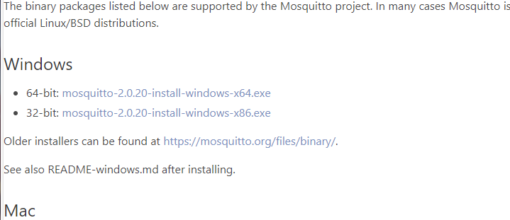
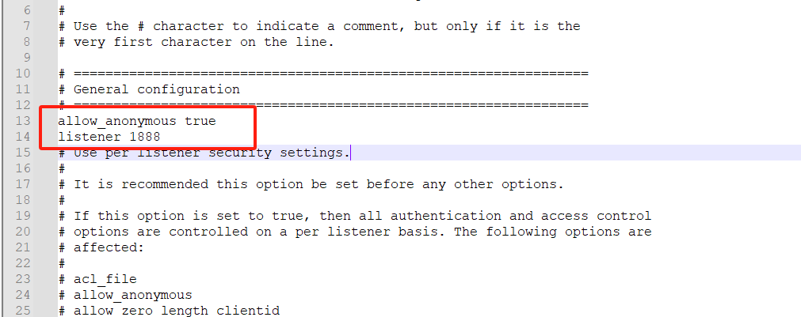
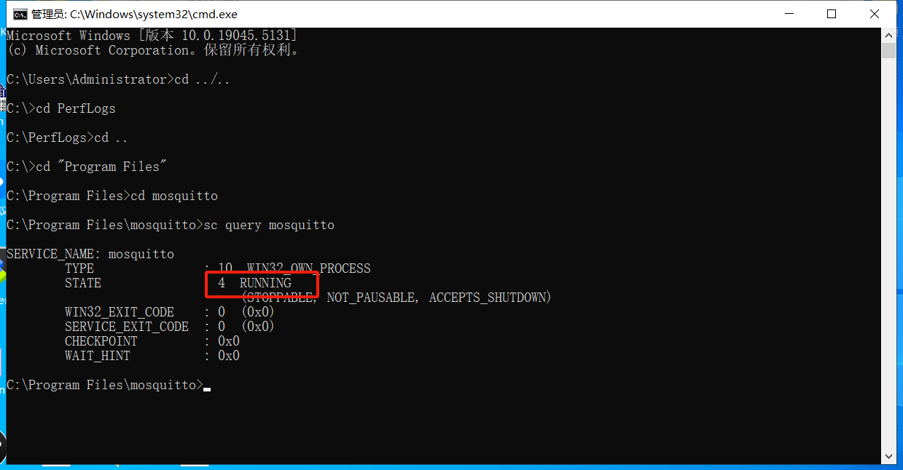
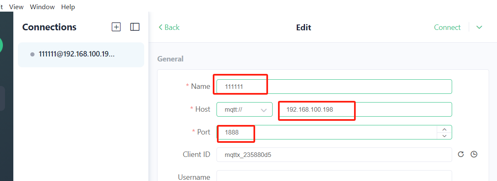
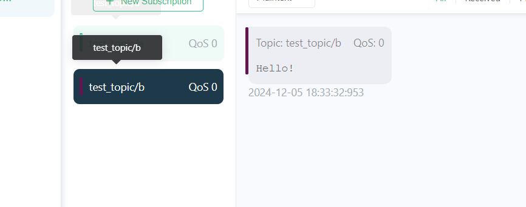
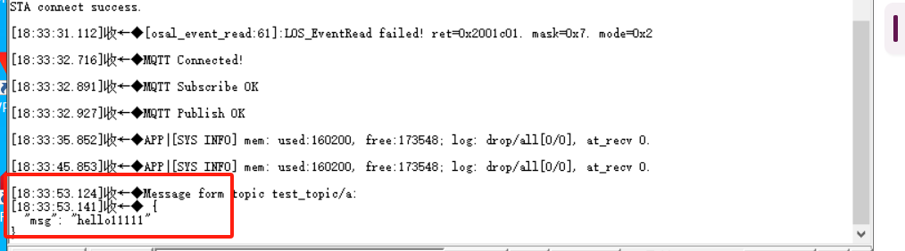

# HopeRun IoT Development Kit--MQTT


An integrated software and hardware development kit based on WS63E solution, providing a comprehensive suite for embedded system development.


## 1. **Compile**

1. Copy the `20_mqtt_demo、paho_mqtt` directory to the `applications\sample\wifi-iot\app` directory within the Oniro source code.
2. Modify the `BUILD.gn` in the `applications\sample\wifi-iot\app` directory of the Oniro source code by replacing the `features` variable with:

```
    features = [
        ...
        "20_mqtt_demo:mqtt_demo",                           # 案例程序模块
        "paho_mqtt/MQTTPacket/src:paho-embed-mqtt3c",       # MQTTPacket模块
        "paho_mqtt/MQTTClient-C/src:paho-embed-mqtt3cc",    # MQTTClient-C模块
        "easy_wifi/src:easy_wifi",                          # EasyWiFi模块
        ...
    ]
```
3. In the `device\soc\hisilicon\ws63v100\sdk\build\config\target_config\ws63\config.py` file, locate the `'ws63-liteos-app'` section. In its `'ram_component'`, comment out the following code：
```
#"mqtt"
```

4. In the file `config.py` located at `device\soc\hisilicon\ws63v100\sdk\build\config\target_config\ws63`, locate the section labeled `'ws63-liteos-app'`. Within this section, add the following code to the `'ram_component'` field:
```
"mqtt_demo", "paho-embed-mqtt3c", "paho-embed-mqtt3cc", "easy_wifi",
```

5. In the file `ohos.cmake` located at `device\soc\hisilicon\ws63v100\sdk\libs_url\ws63\cmake`, locate the section labeled `"ws63-liteos-app"`. Within this section, find the `set(COMPONENT_LIST` statement and append the following code to its argument list:
```
"mqtt_demo"  "paho-embed-mqtt3c" "paho-embed-mqtt3cc"  "easy_wifi"
```
6. Execute the following command in the root directory of the Oniro SDK: `rm -rf out && hb set -p nearlink_dk_3863 && hb build -f`.


## 2. Step
1. The demonstration function of the experiment is to enable message forwarding between the WS63 development board and the computer through a local MQTT server set up using Eclipse Mosquitto.

2. Connect both the computer and the WS63 to the same Wi-Fi network.

3. Go to the Eclipse Mosquitto official website and download the Windows version of the installation program (download link: https://mosquitto.org/download).

4. 

5. Open the Mosquitto installation directory and locate the configuration file. The default path for the configuration file is `C:\Program Files\mosquitto\mosquitto.conf`. Modify it according to your actual situation.

     

6. Edit the configuration file (use a text editor such as Notepad++) to set the basic parameters. Add the following content to the configuration file:

     ```plaintext
     allow_anonymous true
     listener 1888
     ```

     `allow_anonymous true` indicates that anonymous login is allowed

     `listener 1888` indicates that port 1888 is used. Note that this port should not conflict with any other services running on the computer.

7. Open the Command Prompt (cmd) and navigate to the Mosquitto installation directory. Use the command: `cd "C:\Program Files\mosquitto"`

8. Install the Mosquitto service. Use the command: `mosquitto -install`

9. Start the service. Use the command: `net start mosquitto`

     

10. Check the service status. Use the command: `sc query mosquitto`. If the status is "Running," it indicates that the service has started successfully.

11. Download the MQTTX client tool on your computer (download link: https://mqttx.app/zh).

      

12. Create a new connection. The username can be anything, the host address should be configured to the IP address of your computer, and the port should be set to 1888.

13. Click "Connect" to connect to the Mosquitto server.

      

14. Reset the WS63 development board and wait for it to complete initialization. The WS63 board will attempt to connect to the Mosquitto server. Once the connection is successful, the WS63 will send a message to the `topic/b` topic.

      

15. Send a message from the MQTTX client to the `topic/a` topic. The WS63 serial port will print the received message.


### 【Dev-kits】

##### 1. Online marketplaces  https://item.taobao.com/item.htm?abbucket=16&id=816685710481&ns=1&priceTId=214783b117346662457694855ed644&skuId=5533042544092&spm=a21n57.sem.item.49.46a639031zWytE&utparam=%7B%22aplus_abtest%22%3A%22b28048df8f009463834be6bdac2a3713%22%7D&xxc=taobaoSearch

##### 2. **Technical Documentation**

- **Gitee CodeCloud** (User Manuals, Specifications, Oniro Development Cases) **https://gitee.com/hihopeorg_group/near-link**
- **fbb_ws63 Repository** (SDK Packages, Technical Documentation Downloads)**https://gitee.com/HiSpark/fbb_ws63**

##### 3. **Interaction and Support**

- **Hisilicon Community - NearLink Zone Forum** **https://developer.hisilicon.com/forum/0133146886267870001**
